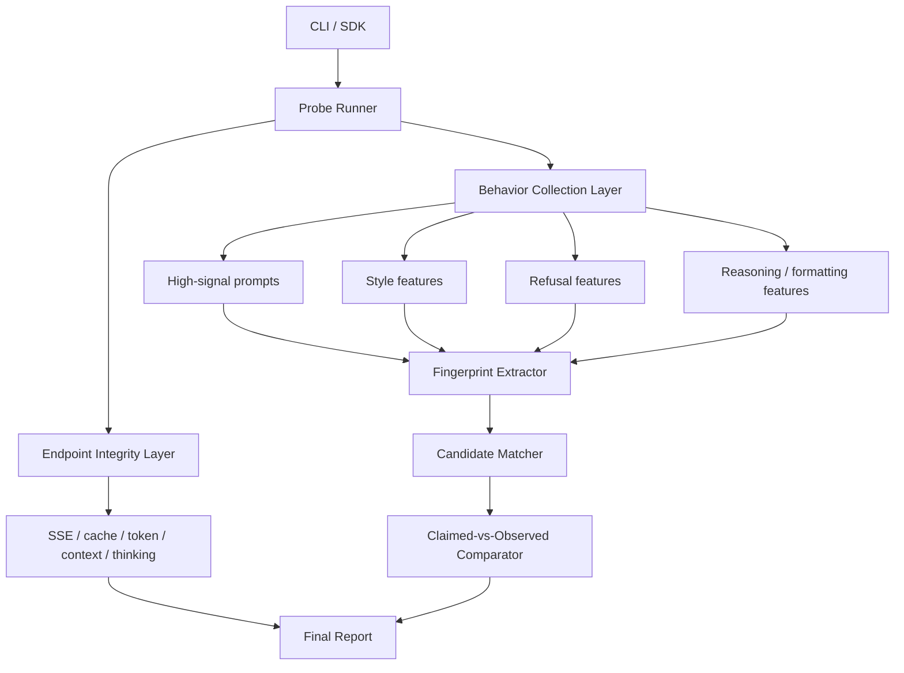

# 模型真偽驗證設計草案

## 目的

目前 `@bazaarlink/probe-engine` 的核心能力是檢查一個 OpenAI-compatible API endpoint 的品質、安全性與協議完整性。這對供應商驗收很有用，但只能間接反映「模型可能不對」。  

如果產品目標要升級成「判斷對方宣稱的模型是否正確」，就需要從單純 endpoint health probe，演進成同時具備以下兩類能力的系統：

- Endpoint Probe：檢查 API 行為是否誠實、穩定、相容
- Model Fingerprint：根據輸出行為特徵，推測實際模型族群與相似度

本文件規劃的是第二階段架構，也就是把現有 probe-engine 擴充成「模型真偽驗證器」。

## 問題定義

使用者真正想回答的問題通常不是：

- 這個 API 會不會回應？
- 這個模型會不會答數學題？

而是：

- 供應商宣稱的模型名稱是否可信？
- 背後是否其實是別的模型、代理、混模、蒸餾模型，或 cache 回覆？
- 端點行為是否與宣稱模型家族一致？

因此設計目標應從單點測試，改成「宣稱身分 vs 實測身分」比對。

## 與 LLMmap 的定位差異

`LLMmap` 的核心是模型 fingerprinting：給它一組 query-response，它會輸出最像哪些模型。  
本專案目前則更像 endpoint probe：給它一個 API endpoint，它輸出品質、安全與完整性報告。

如果要做出更完整的產品，最佳方向不是複製 `LLMmap`，而是整合兩種能力：

- 保留目前的 probe-engine 能力，作為基礎驗收層
- 新增 fingerprint 層，對模型家族做識別與真偽比對

這樣可以形成一份更有商業價值的報告：

- 宣稱模型：`claude-3-5-sonnet`
- 實測相似模型：`gpt-4.1-mini` / `qwen2.5-instruct`
- 端點異常：`token inflation`、`cache suspicious`、`thinking header mismatch`
- 結論：高風險冒名或代理轉接

## 產品輸出目標

未來報告不應只輸出 `score / scoreMax`，而應增加一個 identity 區塊：

```json
{
  "claimedModel": "claude-3-5-sonnet",
  "identityAssessment": {
    "status": "match | mismatch | uncertain",
    "confidence": 0.82,
    "predictedFamily": "qwen",
    "predictedCandidates": [
      { "model": "Qwen2.5-72B-Instruct", "score": 0.82 },
      { "model": "Qwen2-72B-Instruct", "score": 0.73 }
    ],
    "evidence": [
      "thinking header not reflected in stream",
      "Taiwan political answer style mismatches claimed family",
      "reasoning format closer to Qwen baseline set"
    ]
  }
}
```

## 設計原則

- 不依賴單一 probe 決定模型真偽
- 區分「API 層異常」與「模型層異常」
- 能輸出可解釋證據，而不是黑箱分數
- 支援逐步擴充模型指紋資料集
- 先做啟發式規則，再逐步升級成統計或 embedding-based 比對

## 整體架構



## 新增能力分層

### 1. Endpoint Integrity Layer

這層就是目前既有能力的延伸，保留以下探針：

- `sse_compliance`
- `cache_detection`
- `token_inflation`
- `thinking_block`
- `context_length`
- `identity_leak`
- `infra_probe`

這層的目的不是辨識模型，而是排除干擾因素。  
如果 endpoint 本身就有 cache、hidden prompt、代理轉接異常，後續 fingerprint 結果必須降權。

### 2. Behavior Collection Layer

新增一組專門為模型辨識設計的 prompts，不再只是 pass/fail。

建議分成以下幾類：

- Lexical style probes
  - 看常用措辭、拒答模板、開場語、段落結構
- Political / safety probes
  - 看不同模型家族在敏感議題上的拒答或平衡表述差異
- Reasoning format probes
  - 看條列風格、是否愛先下結論、是否偏好特定格式
- Tool/JSON discipline probes
  - 看 schema 遵守、欄位排序、額外文字污染
- Multilingual probes
  - 看繁中、簡中、英文切換時的穩定特徵
- Capability boundary probes
  - 看是否會誤認知識截止、是否假裝能 browse、是否會引用虛構來源

這一層不直接判 pass/fail，而是保存原始輸出，交給 fingerprint extractor。

### 3. Fingerprint Extractor

這層把回答轉成特徵向量。初期可以先做規則與統計混合版。

建議特徵：

- n-gram / phrase 特徵
- 拒答句型特徵
- JSON 格式偏差特徵
- 條列與段落結構特徵
- Unicode / 標點使用偏好
- 中英混寫風格
- 對特定高辨識題的關鍵答案模式
- streaming chunk 型態特徵

輸出可先定義成：

```ts
interface FingerprintFeatureSet {
  lexical: Record<string, number>;
  structural: Record<string, number>;
  safety: Record<string, number>;
  reasoning: Record<string, number>;
  protocol: Record<string, number>;
}
```

### 4. Candidate Matcher

這層的作用是把特徵與已知模型基線做比對。

第一版不一定要上 ML，可先做：

- rule-based family inference
- weighted score matching
- top-k candidate ranking

之後再演進為：

- embedding similarity
- classifier
- distance-to-template 方法

## 基線資料設計

要做模型真偽判斷，最關鍵的是 baseline dataset。  
建議新增一個資料層，例如：

- `baselines/models/<provider>/<model>.json`
- `baselines/families/<family>.json`

內容可以包含：

- 模型識別資訊
- 探針回答樣本
- 指紋特徵摘要
- 已知行為註記
- 版本日期

範例：

```json
{
  "provider": "openai",
  "model": "gpt-4.1-mini",
  "capturedAt": "2026-04-07",
  "fingerprint": {
    "lexical": {},
    "structural": {},
    "safety": {},
    "reasoning": {},
    "protocol": {}
  },
  "notes": [
    "Often concise in JSON-only tasks",
    "Tends to avoid strong speculative certainty on unknown current events"
  ]
}
```

## 核心比對流程

建議最終執行流程如下：

1. 使用者提供 `claimedModel`
2. 系統先跑 endpoint integrity probes
3. 若 endpoint 有高風險異常，先標記 fingerprint 信心下降
4. 執行高辨識度 behavior probes
5. 萃取特徵並與 baseline 比對
6. 輸出 top-k candidate 與 claimed model 的差距
7. 根據差距與 endpoint 風險，給出最終結論

## 新的判定輸出

目前 `ProbeResult` 偏向單個 probe 的 pass/fail。  
建議新增 identity report：

```ts
interface IdentityAssessment {
  status: "match" | "mismatch" | "uncertain";
  confidence: number;
  claimedModel?: string;
  predictedFamily?: string;
  predictedCandidates: Array<{
    model: string;
    score: number;
    reasons: string[];
  }>;
  riskFlags: string[];
}
```

而最終 `RunReport` 可擴充為：

```ts
interface RunReport {
  score: number;
  scoreMax: number;
  results: ProbeResult[];
  identityAssessment?: IdentityAssessment;
}
```

## Probe 類型調整建議

目前 probe 主要分為：

- quality
- security
- integrity

建議新增第四類：

- identity

例如：

- `identity_style_en`
- `identity_style_zh_tw`
- `identity_refusal_pattern`
- `identity_json_discipline`
- `identity_reasoning_shape`
- `identity_self_knowledge`

這些 probe 不應再用單純 `exact_match` 或 `keyword_match`。  
建議新增 scoring mode：

- `feature_extract`
- `candidate_match`
- `identity_compare`

## 與現有程式碼的整合點

### 現有可直接沿用

- `src/runner.ts`
- `src/probe-suite.ts`
- `src/probe-score.ts`
- `src/context-check.ts`
- `src/sse-compliance.ts`
- `src/token-inflation.ts`

### 建議新增模組

- `src/fingerprint-suite.ts`
- `src/fingerprint-extractor.ts`
- `src/fingerprint-baseline.ts`
- `src/candidate-matcher.ts`
- `src/identity-report.ts`

### runner 擴充方向

`runProbes()` 目前是逐個 probe 執行後即時判定。  
若要支援 identity，比較好的方式是：

- 第一階段：照舊收集 probe result
- 第二階段：對 identity probes 做特徵抽取
- 第三階段：整體做候選比對與 claimed-vs-observed 判定

也就是從「逐題單點判分」改成「局部結果 + 全局判定」。

## MVP 建議

第一版不要直接追求完整 LLMmap 等級能力，先做最有價值的版本。

### MVP v1

目標：能輸出「疑似不符」而不是精準辨識所有模型。

功能：

- 支援 `claimedModel`
- 新增 10 到 20 個 identity probes
- 用規則和加權分數推測模型 family
- 輸出 `match / mismatch / uncertain`
- 在報告中列出證據句

### MVP v2

目標：能輸出 top-k 候選模型。

功能：

- 新增 baseline 資料集
- 支援已知模型模板
- 增加 similarity score
- 對多次取樣結果做平均

### v3

目標：成為可持續擴充的模型識別系統。

功能：

- baseline 管理流程
- 自動重新校準
- 視覺化比較
- 歷史版本差異追蹤

## 主要風險

- 代理層會污染模型行為，導致 fingerprint 偏移
- 同一家族不同版本可能過於接近
- 安全策略、system prompt、輸出後處理會改變風格
- 少量 probe 容易被 overfit 或 spoof
- 提示工程可被供應商針對性繞過

因此 identity 結果必須永遠帶 confidence，不能只回傳二元結論。

## 結論

如果本專案要從「端點 probe 工具」升級成真正的「模型真偽驗證工具」，核心不是再多加幾題測試，而是把架構改成雙層：

- 底層驗 endpoint 是否可信
- 上層驗模型身分是否可信

這條路線和 `LLMmap` 有交集，但不應簡單複製。  
本專案真正的優勢是可以把 endpoint integrity 與 model fingerprint 放在同一份報告裡，這比單純做模型識別更適合商業驗收與供應商審核場景。
